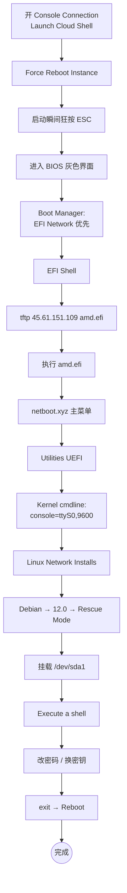

# Oracle Cloud Netboot 重置 root 密码（AMD / x86_64 架构）

> 忘了 Oracle Cloud Always Free AMD 实例的 root 密码，VNC/SSH 都进不去，但控制台还在 —— 用这套流程找回。
>
> ARM 实例请看 [ARM 架构篇](/posts/oracle-cloud-netboot-reset-root-password-arm/)。

## 流程概览



---

## 1. 开 Console Connection 并进 BIOS

### 1.1 用 Cloud Shell 连 Console（最快）

实例详情页 → 左侧菜单 **Console Connection** → 点 **Launch Cloud Shell connection**：


页面下半屏出现黑色终端，说明已经接到串口：


### 1.2 触发重启 + 按 ESC 进 BIOS

实例详情页点 **Reboot Instance**，勾上 **Force Reboot**，确认：


**重启出现 BIOS LOGO 的瞬间，回到 Cloud Shell 窗口反复狂按 `ESC` 键**，几秒钟内会进入灰色 BIOS 界面：


> 错过这一帧就要重新触发 Force Reboot。手要快、ESC 要密集。

### 1.3 改启动顺序到 Network

在 BIOS 里找到 **Boot Manager / Boot Options**，把 **EFI Network**（或类似名字）调到第一位，保存退出。下一次启动就会进入 **EFI Shell**：

```text
Shell> _
```

> 如果你 BIOS 里看不到 EFI Shell 直接出来，可以选 **EFI Internal Shell** 或者从 Boot Manager 手动选 EFI Shell。

---

## 2. EFI Shell 用 TFTP 拉 amd.efi

```text
Shell> fs0:
FS0:\> tftp 45.61.151.109 amd.efi
```

`45.61.151.109` 是公开 netboot/TFTP 源。**这一步最容易卡死**：

```text
Unable to get the size of the file 'amd.efi' on 'eth0' - Time out
```

### 真实根因：两端云安全组没放行 UDP

99% 的 Time out 都是这个：**客户端实例和 TFTP 服务器两端**的云控制层（Security List / NSG）都要放行 UDP。

- TFTP 是 UDP/69，**回包从随机高端口**发回客户端（不是从 69 回）
- 你现在还在 EFI Shell（pre-OS），OS 防火墙没起来，但 **Oracle Cloud Security List 是云控制层规则**，OS 启没启都生效
- Oracle 默认只放 TCP/22 + ICMP，**UDP 一律拦截**
- 所以 server 即使回包了，到你 VNIC 入口被云端拦掉 → 客户端永远收不到 → TFTP 超时

### 修复：两端 Security List 都加 UDP 放行

**Oracle Cloud 端**（被救实例）：

1. Console → **Networking → Virtual Cloud Networks** → 你实例的 VCN
2. 进 **Security Lists**（或 NSG）→ **Ingress Rules → Add Ingress Rule**
3. 填：
   - Source CIDR: `0.0.0.0/0`（或写死 `45.61.151.109/32`）
   - IP Protocol: **UDP**
   - Source Port Range: **All**
   - Destination Port Range: **All**（关键，TFTP 回包是随机端口）

保存立即生效，无需重启。

**TFTP 服务器端**（45.61.151.109 或你自建的）：UDP/69 ingress + UDP egress 全开。

> 公共源 `45.61.151.109` 默认是开放的。如果你**自建** TFTP 服务，记得在你的 VPS 控制台开 UDP。

### 自建 TFTP（如果你想用自己的源）

确认所在云的安全组已开 UDP，然后跑：

```bash
docker run -d --name tftp --restart=unless-stopped --network host \
  -v /your/tftp/root:/srv/tftp \
  cjs520/tftp-netboot:amd64
```

`amd.efi` 可以从 [netboot.xyz](https://netboot.xyz/downloads/) 拿，或直接从这个镜像里的 `/srv/tftp/amd.efi` 拷出来。

---

## 3. 启动 amd.efi 进入 netboot.xyz

TFTP 拉成功后：

```text
FS0:\> amd.efi
```

进入 netboot.xyz 主菜单。

### 3.1 选 Utilities (UEFI)


### 3.2 选 Kernel cmdline params

AMD 路径**专属一步**：Oracle AMD 实例默认走串口输出，必须显式声明 console，不然没显示。


输入：

```text
console=ttyS0,9600
```


回主菜单。

---

## 4. 进 Rescue Mode

依次选：

1. **Linux Network Installs (64-bit)**
2. **Debian**
3. **Debian 12.0 (bookworm)**
4. **Rescue Mode**

> 选 Debian **和原系统无关**，借用 Debian 的救援工具而已。CentOS / Ubuntu / Oracle Linux 原系统都这么选。

选根分区（一般是 `/dev/sda1`）：


如果看到红色挂载警告：


试 sda2、sda3 直到挂上。

确认进 rescue：


选 **Execute a shell in /dev/sdaN**：


继续：


进入 root shell：


---

## 5. 改密码 + 修 SSH

```bash
# 改 root 密码（替换 你的新密码）
echo 'root:你的新密码' | chpasswd root

# 允许 root SSH 登录
sed -i 's/^#\?PermitRootLogin.*/PermitRootLogin yes/g' /etc/ssh/sshd_config
sed -i 's/^#\?PasswordAuthentication.*/PasswordAuthentication yes/g' /etc/ssh/sshd_config

# 清掉可能覆盖主配置的 drop-in
rm -rf /etc/ssh/sshd_config.d/* /etc/ssh/ssh_config.d/*
```

或者用交互式 `passwd`：


### 更推荐：用密钥替代密码登录（更安全）

不开 `PasswordAuthentication`，直接给默认用户放一把新公钥就行。Oracle Cloud 各发行版默认用户名：

| 系统 | 默认用户 |
|---|---|
| Ubuntu | `ubuntu` |
| Oracle Linux / RHEL | `opc` |
| Debian | `debian` |
| CentOS | `centos` |

```bash
# 改成你系统的默认用户
USER=ubuntu

# 目录 + 权限
mkdir -p /home/$USER/.ssh
chmod 700 /home/$USER/.ssh

# 写入你的公钥（粘贴你本机 ~/.ssh/id_ed25519.pub 的内容）
cat > /home/$USER/.ssh/authorized_keys <<'EOF'
ssh-ed25519 AAAAC3Nza.....Cgt2OWWgJiT your-comment@host
EOF

# 权限 + 所有者
chmod 600 /home/$USER/.ssh/authorized_keys
chown -R $USER:$USER /home/$USER/.ssh
```

这种方式**不需要**改 `PermitRootLogin` / `PasswordAuthentication`，安全性远高于密码登录，建议优先选这条路径。

---

## 6. 退出 + 重启

```bash
exit
```

菜单选 **Reboot**：


确认：


**重启前在 Oracle 控制台 / BIOS 把启动顺序改回硬盘**，否则又跳回 netboot。

---

## 排错速查

| 现象 | 原因 | 解决 |
|---|---|---|
| TFTP Time out | 两端云安全组没放 UDP | §2 加 UDP ingress（任意端口） |
| 按 ESC 没进 BIOS | 错过时机 | 再 Force Reboot，重启瞬间狂按 ESC |
| 加载 amd.efi 后串口黑屏 | 没设 `console=ttyS0,9600` | 回 §3.2 设上 |
| Rescue 时挂载报错 | 选错分区 | 试 sda2 / sda3 |
| SSH 改完还连不上 | OS 内防火墙或 Oracle Security List 拦 22 | rescue shell 里 `iptables -F` + 控制台开 22 ingress |

---

## 参考

- 原始流程：[OracleCloudInstancesNetbootResetRootPassword](https://telegra.ph/OracleCloudInstancesNetbootResetRootPassword-10-07)
- Console 连接方法：[OracleCloudInstancesConsoleConnection](https://telegra.ph/OracleCloudInstancesConsoleConnection-10-02)
- netboot.xyz：<https://netboot.xyz/>
