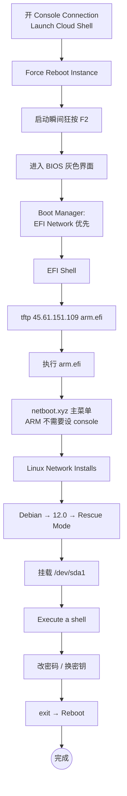

# Oracle Cloud Netboot 重置 root 密码（ARM / aarch64 架构）

> 忘了 Oracle Cloud Ampere A1 实例的 root 密码，VNC/SSH 都进不去，但控制台还在 —— 用这套流程找回。
>
> AMD 实例请看 [AMD 架构篇](/posts/oracle-cloud-netboot-reset-root-password-amd/)。

## 流程概览



> **和 AMD 篇的核心差异**：ARM 走 PL011 SBSA UART，内核自动识别串口，**不需要**手动设 `console=ttyS0,9600`。Utilities → Kernel cmdline 那一步直接跳过。

---

## 1. 开 Console Connection 并进 BIOS

ARM 实例支持两种方式接 Console，**推荐 ① CloudShell**，最快。

### 1.1 方式 ①：Cloud Shell 接串口

实例详情页 → 左侧菜单 **Console Connection** → 点 **Launch Cloud Shell connection**：


页面下半屏出现黑色终端：


### 1.2 方式 ②：跳板机 VNC（看图形界面更直观）

如果你想在图形界面里操作 BIOS（按键反应更可靠），需要一台**跳板机**（不限架构，AMD ARM 都行，2 vCPU 即可）。

1. 跳板机生成 SSH 密钥：`ssh-keygen`，复制 `~/.ssh/id_rsa.pub` 内容
2. Oracle 实例详情 → Console Connection → **Create Local Connection** → 粘贴跳板机的公钥：

   

3. 创建后右边三点菜单 → **Copy VNC connection for Linux/Mac**：

   

4. 把命令里的 `localhost:5900` 改成 `0.0.0.0:5900`，在跳板机上跑这条命令
5. 跳板机开 TCP/5900 入向，本地用 [RealVNC Viewer](https://www.realvnc.com/en/connect/download/viewer/) 连 `跳板机IP:5900`

> 跳板机如果 SSH 协商失败，编辑 `/etc/ssh/ssh_config` 加：
> ```
> Host *
>     HostKeyAlgorithms +ssh-rsa
>     PubkeyAcceptedKeyTypes +ssh-rsa
> ```
> 然后 `systemctl restart sshd`。

### 1.3 触发重启 + 按 F2 进 BIOS

Oracle 实例详情页点 **Reboot Instance**，勾上 **Force Reboot**，确认：


**重启出现 BIOS LOGO 瞬间，在 Cloud Shell（或 VNC）窗口反复狂按 `F2` 键**（ARM 是 F2，不是 ESC），几秒钟内进入 BIOS：


如果你用 VNC，画面里也有 reboot 按钮：


> 错过 F2 时机就要重新 Force Reboot，按键要密集。

### 1.4 改启动顺序到 Network

BIOS 里 **Boot Manager / Boot Options** → 把 **EFI Network** 调到第一位 → 保存退出。下次启动进入 **EFI Shell**：

```text
Shell> _
```

---

## 2. EFI Shell 用 TFTP 拉 arm.efi

```text
Shell> fs0:
FS0:\> tftp 45.61.151.109 arm.efi
```

`45.61.151.109` 是公开 netboot/TFTP 源。**这一步最容易卡死**：

```text
Unable to get the size of the file 'arm.efi' on 'eth0' - Time out
```

### 真实根因：两端云安全组没放行 UDP

99% 的 Time out 都是这个 —— **客户端实例和 TFTP 服务器两端**的云控制层（Security List / NSG）都要放行 UDP。

- TFTP 是 UDP/69，**回包从随机高端口**发回客户端
- 你现在在 EFI Shell（pre-OS），OS 防火墙没起来，但 **Oracle Security List 是云控制层规则**，OS 启没启都生效
- Oracle 默认只放 TCP/22 + ICMP，**UDP 一律拦截**
- server 即使回包了，到 VNIC 入口被云端拦掉 → TFTP 超时

### 修复：两端 Security List 都加 UDP 放行

**Oracle Cloud 端**（被救实例）：

1. Console → **Networking → Virtual Cloud Networks** → 你实例的 VCN
2. **Security Lists**（或 NSG）→ **Ingress Rules → Add Ingress Rule**
3. 填：
   - Source CIDR: `0.0.0.0/0`（或 `45.61.151.109/32`）
   - IP Protocol: **UDP**
   - Source Port Range: **All**
   - Destination Port Range: **All**（关键，TFTP 回包是随机端口）

立即生效。

**TFTP 服务器端**：UDP/69 ingress + UDP egress 全开。公共源 `45.61.151.109` 默认是开的；自建的话记得在你 VPS 控制台开 UDP。

### 自建 TFTP

```bash
docker run -d --name tftp --restart=unless-stopped --network host \
  -v /your/tftp/root:/srv/tftp \
  cjs520/tftp-netboot:amd64
```

`arm.efi` 可以从 [netboot.xyz](https://netboot.xyz/downloads/) 拿，或从这个镜像的 `/srv/tftp/arm.efi` 拷出。

---

## 3. 启动 arm.efi 进入 netboot.xyz

```text
FS0:\> arm.efi
```

> ARM 不用像 AMD 篇那样设 `console=ttyS0,9600`，PL011 SBSA UART 内核会自动识别。

直接进入 netboot.xyz 主菜单。

---

## 4. 选到 Rescue Mode

### 4.1 Linux Network Installs (64-bit)


### 4.2 Debian


> 选 Debian **和原系统无关**，借用 Debian 的救援工具而已。CentOS / Ubuntu / Oracle Linux 原系统都这么选。

### 4.3 Debian 12.0 (bookworm)


### 4.4 Rescue Mode


---

## 5. 选根分区进救援 shell

ARM 实例根分区常见 `/dev/sda1`：


少数 LVM 镜像看到另一种界面：


如果挂载报红色警告：


试 sda2、sda3 直到挂上。挂载成功 → **Yes** 确认：


选 **Execute a shell in /dev/sdaN**：


继续：


进入 root shell：


---

## 6. 改密码 + 修 SSH

```bash
# 改 root 密码（替换 你的新密码）
echo 'root:你的新密码' | chpasswd root

# 允许 root SSH 登录
sed -i 's/^#\?PermitRootLogin.*/PermitRootLogin yes/g' /etc/ssh/sshd_config
sed -i 's/^#\?PasswordAuthentication.*/PasswordAuthentication yes/g' /etc/ssh/sshd_config

# 清掉可能覆盖主配置的 drop-in
rm -rf /etc/ssh/sshd_config.d/* /etc/ssh/ssh_config.d/*
```

或用交互式 `passwd`：


### 更推荐：用密钥替代密码登录（更安全）

不开 `PasswordAuthentication`，直接给默认用户放一把新公钥就行。Oracle Cloud 各发行版默认用户名：

| 系统 | 默认用户 |
|---|---|
| Ubuntu | `ubuntu` |
| Oracle Linux / RHEL | `opc` |
| Debian | `debian` |
| CentOS | `centos` |

```bash
# 改成你系统的默认用户
USER=ubuntu

# 目录 + 权限
mkdir -p /home/$USER/.ssh
chmod 700 /home/$USER/.ssh

# 写入你的公钥（粘贴你本机 ~/.ssh/id_ed25519.pub 的内容）
cat > /home/$USER/.ssh/authorized_keys <<'EOF'
ssh-ed25519 AAAAC3Nza.....Cgt2OWWgJiT your-comment@host
EOF

# 权限 + 所有者
chmod 600 /home/$USER/.ssh/authorized_keys
chown -R $USER:$USER /home/$USER/.ssh
```

这种方式**不需要**改 `PermitRootLogin` / `PasswordAuthentication`，安全性远高于密码登录，建议优先选这条路径。

---

## 7. 退出 + 重启

```bash
exit
```

菜单选 **Reboot**：


确认：


**重启前在 Oracle 控制台 / BIOS 把启动顺序改回硬盘**，否则又跳回 netboot。

---

## 排错速查

| 现象 | 原因 | 解决 |
|---|---|---|
| TFTP Time out | 两端云安全组没放 UDP | §2 加 UDP ingress（任意端口） |
| 按 F2 没进 BIOS | 错过时机 | Force Reboot 重来，密集按 F2 |
| 加载 arm.efi 提示架构错 | 拉成了 amd.efi | 确认 `tftp 45.61.151.109 arm.efi` |
| 所有 sdaN 挂不上 | 用了 LVM | 试 `/dev/mapper/vg0-root` 等 |
| SSH 改完还连不上 | OS 防火墙或 Security List 拦 22 | rescue shell 里 `iptables -F` + 控制台开 22 ingress |

---

## 参考

- 原始流程：[OracleCloudInstancesNetbootResetRootPassword](https://telegra.ph/OracleCloudInstancesNetbootResetRootPassword-10-07)
- Console 连接方法：[OracleCloudInstancesConsoleConnection](https://telegra.ph/OracleCloudInstancesConsoleConnection-10-02)
- netboot.xyz：<https://netboot.xyz/>
