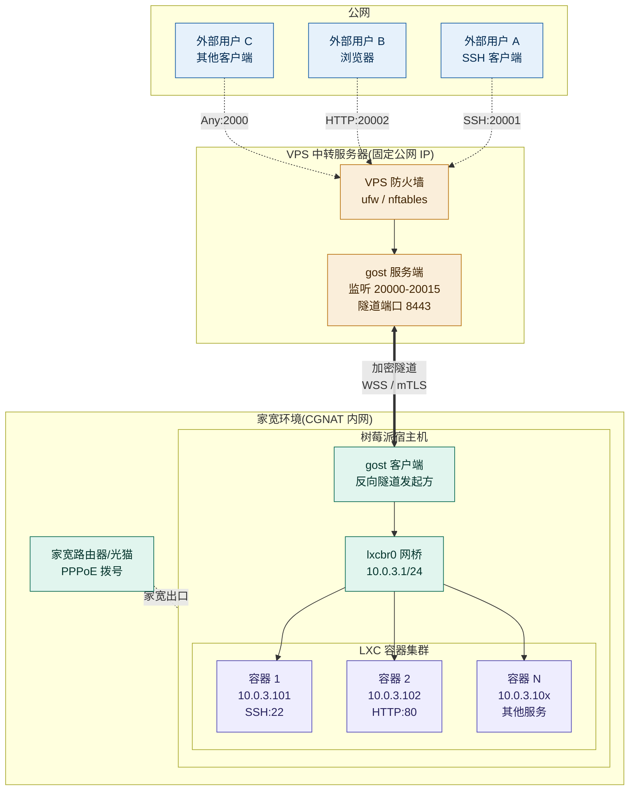
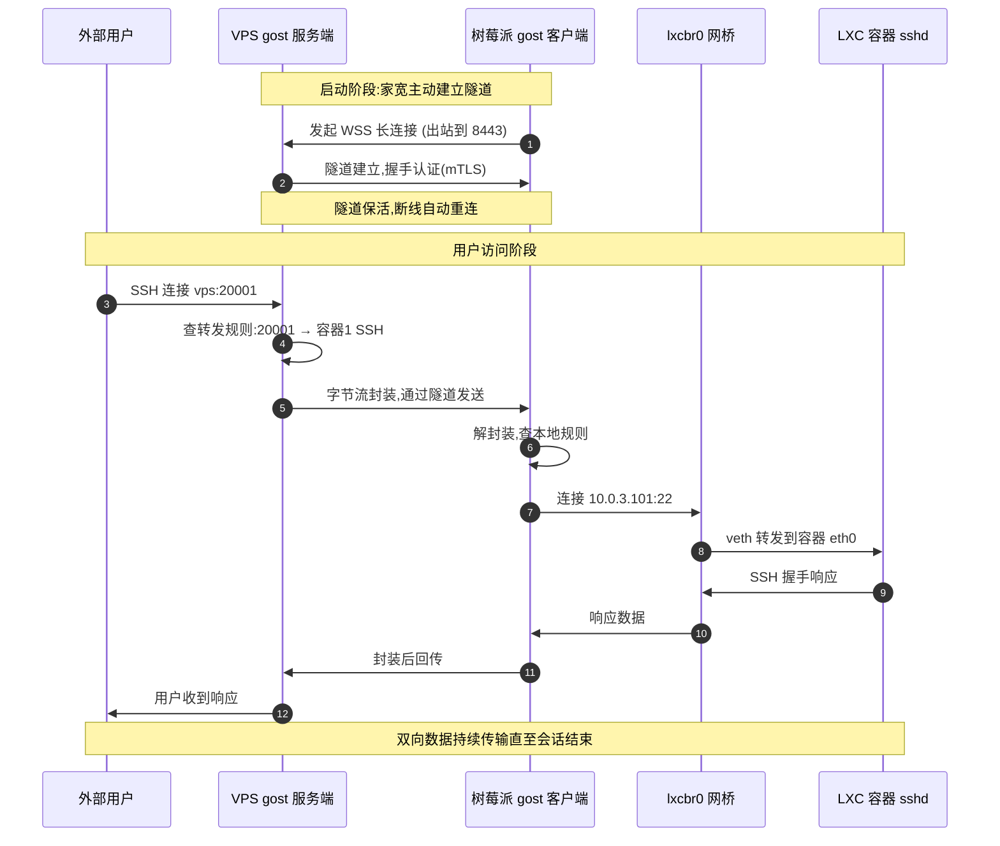
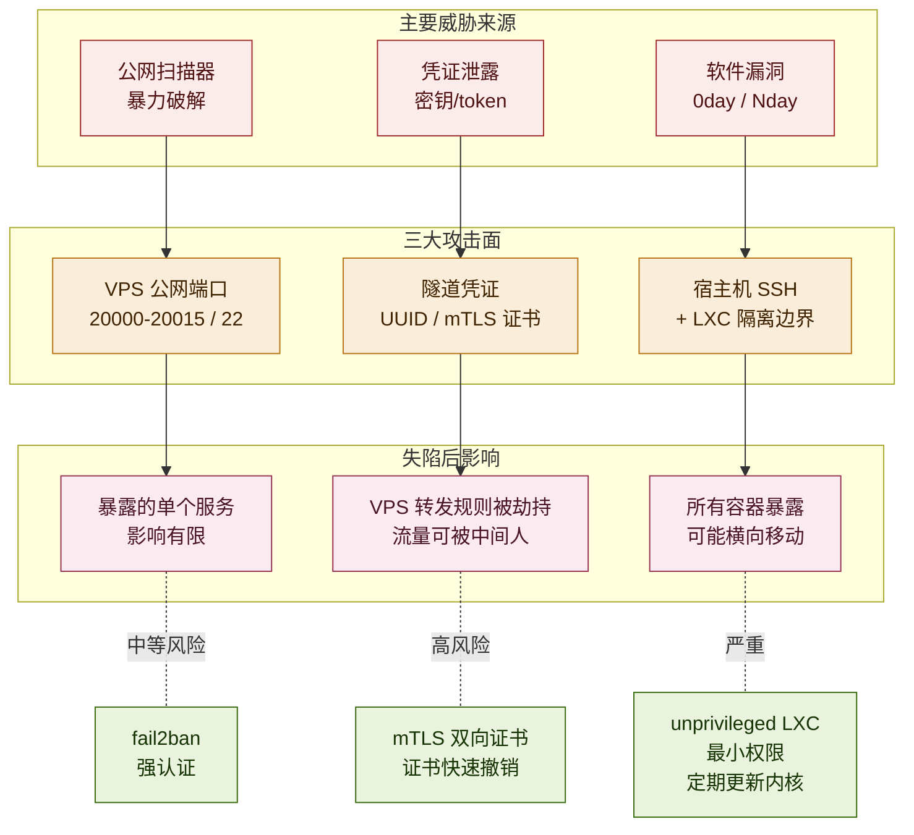
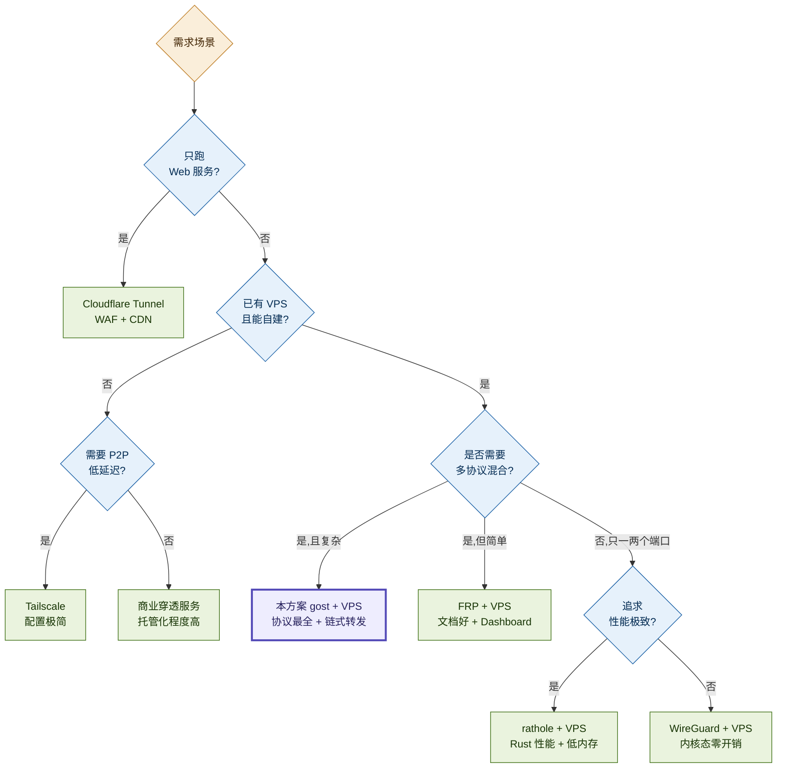
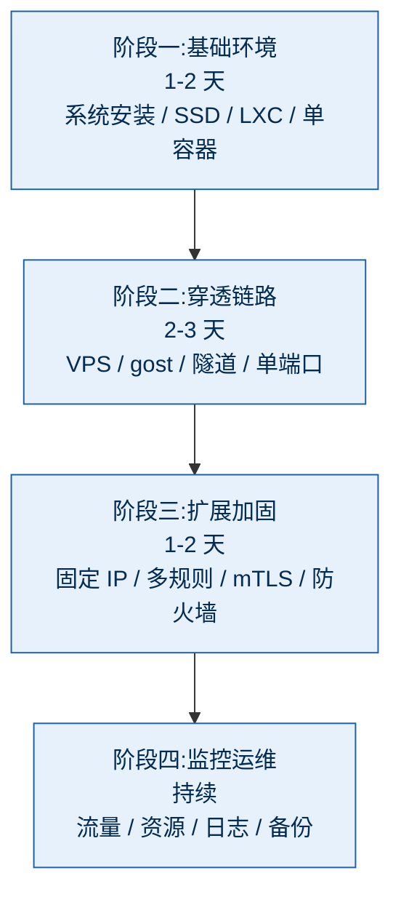

# 基于 gost 反向隧道的家宽 LXC 容器公网穿透技术可行性研究报告

> **版本**:v1.2(技术可行性主文)
> **日期**:2026-05-13
> **受众**:技术决策者(架构师、SRE、运维负责人)
> **目的**:评估在无公网 IP 的家宽环境下,使用 gost + LXC + VPS 中转架构对外提供服务的技术可行性

---

## 图表索引

本报告共包含 6 张可视化图表,采用 Mermaid 语法绘制,在 GitHub / VSCode / Typora / Obsidian 等主流 Markdown 渲染器中均可直接显示:

| 图表 | 章节 | 类型 | 作用 |
|------|------|------|------|
| 整体架构图 | §2.1 | 流程图 | 展示四层分层架构与组件关系 |
| 数据流时序图 | §2.2 | 时序图 | 展示一次完整请求的步骤序列 |
| 性能瓶颈链路图 | §4.2 | 流程图 | 直观标示家宽上行是核心瓶颈 |
| 攻击面分布图 | §5.1 | 流程图 | 三大攻击面、威胁源、失陷影响、缓解策略 |
| 选型决策树 | §6.3 | 决策树 | 从需求出发的快速选型路径 |
| 实施路线阶段图 | §8.3 | 流程图 | 四阶段实施顺序 |

---

## 一、研究背景与问题陈述

国内家宽环境近年来普遍呈现两个特征:**公网 IP 资源紧缩**和**CGNAT 大规模部署**。多数普通家庭宽带用户即便 PPPoE 拨号成功,获取到的也是运营商大内网地址(100.64.0.0/10 段),外部主机无法主动连入。与此同时,基于 LXC 等轻量级容器在家用设备(如树莓派)上部署自托管服务的需求持续增长,自建博客、Git 仓库、监控面板、远程开发环境等场景对"对外可达"提出了硬性要求。

本报告评估的方案,核心是:**家宽内部树莓派宿主机上的 gost 进程主动连接公网 VPS 建立加密隧道,VPS 作为对外入口,把外部流量经隧道分发到宿主机内的多个 LXC 容器**。这是一个典型的"反向穿透"架构。

报告需要回答三个问题:这套架构在技术上能跑通吗?跑通之后稳定性、性能、安全性如何?和市面上其他方案比,值不值得选?

---

## 二、方案总览

### 2.1 架构组成

整套方案由四层组成,自外向内:

第一层是**外部用户**,通过浏览器、SSH 客户端或其他工具访问 VPS 的公网 IP 加指定端口,用户无需感知后端架构。

第二层是**VPS 中转服务器**,一台拥有固定公网 IP 的低配云主机,运行 gost 服务端,既是隧道的承载方,也是对外服务入口。常见监听端口段为 20000-20015 这类高位端口区间,以及隧道控制端口(如 8443)。

第三层是**家宽宿主机**,通常是树莓派或类似的低功耗 ARM 设备,运行 Raspberry Pi OS 或 Debian。宿主机上的 gost 客户端主动出站连接 VPS 建立长隧道,同时作为 LXC 容器的网络网关,通过 `lxcbr0` 网桥与容器互联。

第四层是**LXC 容器集群**,每个容器拥有独立 IP(如 10.0.3.0/24 段)、独立 rootfs、独立进程空间,运行各自的业务服务。容器对穿透架构无感知,只接收来自 lxcbr0 的内网流量。

整体架构如下图所示:

**关键特征**:虚线箭头表示外部用户的请求方向,双向粗箭头表示加密隧道(由家宽主动发起,数据双向流动)。家宽端**不需要任何公网入站端口**,所有连接均由家宽主动出站建立,完美适配 CGNAT 环境。

### 2.2 数据流路径

以"外部用户 SSH 访问 LXC 容器 1"为例,完整路径如下:

用户 SSH 客户端发起到 `vps.example.com:20001` 的 TCP 连接;VPS 上 gost 服务端在 20001 端口接收,查转发规则,把字节流封装后通过已建立的隧道发回家宽;树莓派宿主机的 gost 客户端从隧道收到数据,解封装,查本地规则得知目标是 `10.0.3.101:22`,发起对该地址的新 TCP 连接;流量经 lxcbr0 网桥进入容器 veth,被容器内 sshd 接收。响应原路返回。

整条链路的关键特性:**隧道建立方向(家宽 → VPS)与数据流向(双向)解耦**。隧道一旦建立,即可承载任意方向的数据传输。

下图展示了一次完整请求的时序:

**时序图说明**:步骤 1-2 是启动阶段,只发生一次;步骤 3-11 是每次用户访问都会执行的转发流程。容器内 sshd 只看到来自 `10.0.3.1`(网关)的连接,完全不感知公网穿透的存在。

### 2.3 关键设计选择

宿主机部署 gost 而非容器内部署 gost,是这套架构的核心选择。这意味着 N 个 LXC 共享 1 个 gost 进程、1 条隧道,容器内部保持纯净。此选择的安全权衡将在安全性分析章节详细分析。

---

## 三、技术可行性分析

### 3.1 网络层可行性

**CGNAT 突破能力**:gost 隧道由家宽主动发起出站连接,所有运营商默认放行出站 TCP/443、TCP/80、UDP/443 等通用端口,因此 CGNAT 不构成阻碍。隧道协议可选 WSS(WebSocket over TLS)、KCP、QUIC、mTLS 等,WSS 模式下流量在网络层呈现为标准 HTTPS,过运营商和企业防火墙的兼容性最好。

**端口复用**:gost 支持单一隧道承载多个 TCP/UDP 服务转发,VPS 上开多少个监听端口对应多少个 LXC 服务,但只需一条隧道连接。VPS 防火墙仅需放行实际使用的端口段。

**容器网络**:LXC 默认网络拓扑(lxcbr0 网桥 + 容器 veth)是 Linux 标准功能,内核原生支持,不存在兼容性风险。宿主机作为容器默认网关并执行 MASQUERADE,容器出网与宿主机普通进程出网走同一路径。

### 3.2 协议层可行性

gost 3.x 版本提供完整的反向隧道(rtcp/rudp)和命名隧道(tunnel)能力,经过多年生产环境验证,在 GitHub 拥有活跃维护(可通过 `https://github.com/go-gost/gost` 查证版本与 issue 情况)。协议栈成熟,不存在协议缺陷导致的不可行风险。

LXC 项目自 2008 年发布以来已并入主流 Linux 发行版,Debian/Ubuntu 仓库直接可装,网络模型与防火墙交互在 iptables 和 nftables 上均有充分文档支持。

### 3.3 硬件层可行性

树莓派 4B(4GB 内存版)及以上型号完全满足需求。实测数据:gost 客户端进程稳态内存占用约 20-30MB,单个 LXC 容器(Alpine 基础)运行时内存约 30-50MB,10 个轻量容器加宿主系统总占用控制在 1GB 以内。CPU 方面,gost 在加密隧道流量下单核可处理约 100-300 Mbps,ARM Cortex-A72 性能足以应对家宽上行带宽。

存储方面,SD 卡作为根文件系统存在写入寿命问题,建议根分区或容器 rootfs 挂载到 SSD,这是一个**实施前必须解决的硬约束**。

### 3.4 综合判定

技术可行性**充分**。本方案的所有组件均为成熟开源软件,网络协议路径清晰,硬件需求在消费级范围内,无未知技术风险。

---

## 四、性能评估

### 4.1 延迟特征

延迟由三段构成:用户到 VPS 的 RTT、VPS 到家宽的 RTT(隧道传输)、家宽内部转发延迟。在国内常见部署(VPS 选香港/日本/新加坡):

- 用户→VPS:**10-50ms**,取决于用户地域和 VPS 位置
- VPS→家宽:**30-80ms**,经公网且需要 TLS 解封装
- 宿主机→容器:**< 1ms**,内核态网桥转发

总链路 RTT 通常落在 **50-130ms**,相比直连 VPS 上的服务额外增加 30-80ms。对 SSH、Web 浏览、文件传输无显著影响,对实时音视频、游戏等延迟敏感场景需谨慎评估。

### 4.2 吞吐能力

吞吐瓶颈按从严到松排序通常是:

1. **家宽上行带宽**:国内家宽典型上行为 30-100Mbps,这是绝大多数场景的硬上限
2. **VPS 出口带宽**:廉价 VPS 一般限速 100Mbps-1Gbps
3. **gost 加密开销**:树莓派 4B 单核加密吞吐约 100-300Mbps
4. **网桥转发**:几乎无瓶颈,内核态零拷贝

实际生产场景下,**家宽上行**是 99% 情况下的瓶颈。

下图直观展示了链路各环节的带宽能力对比:

**红色环节(家宽上行)是 99% 场景的硬瓶颈**,优化其他环节收益有限。如果家宽上行只有 30Mbps,无论 VPS 多贵、树莓派多强,实际可用带宽就是 30Mbps 上限。

### 4.3 并发与连接数

gost 单实例可稳定维持 1000+ 并发 TCP 连接,树莓派 4B 的内存和文件描述符限制下,挂 2000-3000 个活跃连接没有问题,但建议:

- 调整 `ulimit -n` 至 65536
- 调整 `net.netfilter.nf_conntrack_max` 至 1M
- 调整 `net.ipv4.ip_local_port_range` 给出足够端口范围

### 4.4 稳定性

PPPoE 每日掉线、VPS 重启、网络抖动是三类典型扰动。gost 自带断线重连机制,默认 5 秒重试,实测从断线到隧道恢复平均 10-30 秒。对长连接业务(如 SSH 会话、持续下载)在此期间会断开,需要应用层重试或会话恢复机制配合。

建议配置 `systemd` 的 `Restart=always` 保障 gost 进程级守护,并在 VPS 端启用 keepalive 检测死链。

---

## 五、安全性分析

### 5.1 攻击面盘点

**VPS 公网入口**是最大攻击面。开放的端口段直接暴露在互联网,任何扫描器都能探测到。如果端口对应的是 SSH/RDP 这类强身份认证服务,风险可控;如果是无认证的 HTTP 或调试接口,等同于在公网裸奔。

**gost 隧道凭证**是第二个关键攻击面。隧道 token/UUID 一旦泄露,攻击者可以伪装家宽节点接管 VPS 上的转发规则。建议使用 mTLS 双向证书替代单纯 token。

**树莓派宿主机**作为流量汇聚点,一旦被入侵,所有 LXC 容器都暴露。LXC 提供的隔离强度低于 KVM,内核漏洞可能导致逃逸。

三大攻击面及其失陷后影响范围如下图所示:

### 5.2 安全控制建议

**网络层**:VPS 防火墙(ufw / nftables)严格白名单,仅放行必需端口;隧道控制端口绑定 VPS 内部接口或限制源 IP;启用 fail2ban 防 SSH 爆破。

**身份认证**:全链路禁用密码登录,SSH 密钥使用 ed25519 算法,每台设备独立密钥对;gost 隧道启用 mTLS,证书由自建私有 CA 签发,泄露后可单独撤销。

**容器隔离**:LXC 优先使用 unprivileged 模式;每个容器独立 user namespace,即便容器内 root 也是宿主机无权限用户;敏感容器加 AppArmor/SELinux profile。

**审计与日志**:auth.log 集中化到 VPS 或独立日志机器;gost 启用访问日志,记录每条连接的源 IP、目标端口、字节数;关键容器内启用 auditd 监控文件访问。

**应急响应**:制定隧道凭证泄露、VPS 失陷、宿主机失陷三类场景的处置预案;隧道凭证、SSH 密钥、TLS 证书都要有快速撤销与重发流程。

### 5.3 安全等级判定

在落实上述控制后,本方案的安全等级可达到**个人/小团队自托管的合理水准**,但不建议承载以下场景:

- 处理个人敏感数据(身份证、银行账号)
- 商业秘密、合同等高价值文档
- 对外提供注册类公共服务(用户多、攻击面大)
- 任何监管合规要求 ISO 27001、等保三级以上的业务

---

## 六、替代方案对比

### 6.1 候选方案清单

| 方案 | 核心机制 | 公网依赖 |
|------|---------|---------|
| 本方案(gost + VPS) | 反向隧道 | 需自有 VPS |
| FRP + VPS | 反向代理 | 需自有 VPS |
| rathole + VPS | 反向代理(Rust) | 需自有 VPS |
| WireGuard + VPS | 网络层 VPN | 需自有 VPS |
| Tailscale | 网状 VPN(P2P + 中继) | 依赖商业控制面 |
| Cloudflare Tunnel | 边缘网络隧道 | 依赖 Cloudflare |
| 内网穿透商业服务(花生壳等) | 商业 SaaS | 依赖供应商 |
| 公网 IP 申请 | 直接拨号公网 | 运营商支持 |

### 6.2 多维度对比

| 方案 | 性能 | 灵活性 | 配置复杂度 | 稳定性 | 技术适用边界 |
|------|------|--------|----------|--------|--------------|
| gost + VPS | 高 | 极高 | 中 | 高 | 多协议、链式转发、精细控制 |
| FRP + VPS | 高 | 高 | 低-中 | 高 | 常规 TCP/UDP 暴露,生态成熟 |
| rathole + VPS | 极高 | 中 | 低 | 高 | 少量端口、高性能、低资源占用 |
| WireGuard + VPS | 极高 | 中 | 中 | 高 | 网络层互通,适合点到点或组网 |
| Tailscale | 高 | 中 | 极低 | 高(依赖第三方控制面) | 私有访问和多人组网,不适合直接公网发布 |
| Cloudflare Tunnel | 中 | 低(仅 HTTP/S) | 低 | 高(依赖 CF) | Web 服务优先,非 HTTP/S 能力受限 |
| 花生壳等商业 | 中 | 低 | 极低 | 中 | 快速暴露少量服务,深度控制能力弱 |
| 公网 IP 直连 | 极高 | 极高 | 低 | 高 | 依赖运营商分配公网地址 |

### 6.3 选型决策树

下图给出从需求出发的快速选型路径:

**决策树关键节点说明**:

如果需求是**Web 服务为主、不想自建 VPS**,Cloudflare Tunnel 是优先候选,自带 WAF/CDN,但仅适合 HTTP/S 为主的服务。

如果是**纯内网工具(SSH/RDP/NAS)只给自己和少数人用**,Tailscale 配置最简单,P2P 路径下延迟最低。

如果**已有 VPS、需要多协议穿透、要求精细控制**,gost 和 FRP 都是合格选择。gost 在协议丰富度、链式转发上更胜一筹;FRP 在文档完整度、Web Dashboard 上体验更好。

如果**追求极致性能 + 最低资源占用**,rathole 是最佳选择,但功能比 gost 简洁。

如果**技术不熟、且不在乎厂商绑定**,商业穿透服务能降低部署门槛,但协议能力和可控性通常弱于自建。

**本方案的最佳适用场景**:技术能力中等以上、需要跑 5-20 个 LXC 容器多协议混合、对架构灵活度有要求、能接受中等运维复杂度。

---

## 七、风险登记册

| 风险 | 可能性 | 影响 | 缓解措施 |
|------|-------|------|---------|
| VPS 被封禁或回收 | 中 | 高 | 多 VPS 冗余;DNS 切换预案 |
| 家宽上行被限速或抖动 | 低-中 | 高 | 控制公网暴露面;监控带宽峰值与丢包 |
| 树莓派硬件故障(SD 卡损坏为主) | 中 | 中 | 改用 SSD;定期镜像备份 |
| gost 漏洞导致隧道失陷 | 低 | 高 | 及时升级;mTLS 双向认证 |
| LXC 逃逸 | 低 | 高 | unprivileged 容器;最小化容器内权限 |
| PPPoE 每日掉线影响业务 | 高 | 低 | 应用层重试;长连接业务有限度 |
| 域名/证书过期 | 中 | 中 | 自动续期;监控告警 |
| 中转 VPS 单点故障 | 中 | 高 | 双 VPS 主备;HAProxy 负载 |

---

## 八、可行性结论

### 8.1 总评

**技术可行性:充分** —— 所有组件成熟、文档完善、社区活跃,无未知技术障碍。

**资源可行性:良好** —— 低功耗 ARM 主机加轻量 LXC 容器即可承载,瓶颈主要在家宽上行和 VPS 出口带宽。

**运维可行性:中等** —— 需要中等以上 Linux 运维能力,初次搭建 1 天可完成,长期维护轻量但不可忽视。

**安全可行性:可控** —— 在落实推荐安全控制后,达到个人/小团队自托管的合理水准,不适合承载高敏感业务。

### 8.2 推荐决策

**建议采纳**,前提是符合以下全部条件:

1. 团队具备基础 Linux 与网络运维能力
2. 能接受 30-80ms 的额外网络延迟
3. 业务对家宽 30-100Mbps 上行带宽不敏感
4. 能落实 SSH 密钥、mTLS、防火墙、日志审计等基础安全控制
5. 能接受 VPS 中转节点单点故障,或愿意额外部署主备链路

如其中任一条件不满足,建议改选第六章对应的替代方案。

### 8.3 实施路线建议

整体建议分四阶段推进:

**阶段一(1-2 天)**:基础环境搭建。树莓派系统安装、SSD 挂载、LXC 安装、网络验证、单容器跑通。

**阶段二(2-3 天)**:穿透链路建立。VPS 选购与初始化、gost 双端部署、隧道建立、单端口转发验证。

**阶段三(1-2 天)**:多容器扩展与安全加固。容器固定 IP 配置、gost 多规则配置、mTLS 启用、防火墙收紧、密钥分发。

**阶段四(持续)**:监控与运维。vnstat 流量监控、Netdata 资源监控、日志聚合、备份策略、告警通道搭建。

完整 PoC 验证周期建议预留 **5-7 个工作日**,具备充分缓冲应对未预期问题。

---

## 附录 A:关键技术参数速查

| 参数 | 推荐值 |
|------|-------|
| 树莓派最低配置 | Pi 4B 4GB,SSD 启动 |
| VPS 最低配置 | 1C/512MB/100Mbps,境外节点 |
| gost 版本 | 3.x 最新稳定版 |
| 隧道协议 | WSS(穿透性最好)或 mTLS(安全性最高) |
| LXC 网络 | lxcbr0,10.0.3.0/24 |
| 容器 IP 分配 | 静态绑定,避免重启变化 |
| SSH 端口 | VPS 22 端口非标改写,容器内可保留 |
| 监听端口段 | 20000-65535高位段 |
| 隧道控制端口 | 8443(伪装 HTTPS) |

## 附录 B:决策检查清单

实施前请逐项确认:

- [ ] 团队具备 Linux 系统、iptables、SSH 密钥管理基础
- [ ] 已采购或确认 VPS 资源(含地理位置选择)
- [ ] 已制定 SSH/TLS 密钥管理流程
- [ ] 已规划备份策略(尤其容器 rootfs 与 gost 配置)
- [ ] 已制定 VPS 失联、隧道失陷的应急预案
- [ ] 已配置基础监控与告警通道

---

*本报告基于截至 2026 年 5 月的开源软件版本与公开行业惯例。具体部署前请结合最新版本特性与本地法规审视。*
