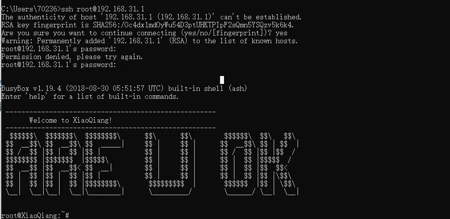

# 小米路由器开发板环境制作

## 准备条件
a.小米路由器型号要符合支持开发板，参考下图；

b.下载开发板固件（与路由器型号匹配）：选择下载>ROM>小米路由器3
下载小米路由器3 开发版（miwifi_r3_firmware_e9f31_2.27.120.bin）

- http://miwifi.com/miwifi_download.html
    - 
## 升级固件
### 步骤一
路由器初始管理平台地址：[http://192.168.31.1](http://192.168.31.1/)。登陆小米路由器的web界面，进入后台。选择手动升级，上传开发版固件（miwifi_r3_firmware_e9f31_2.27.120.bin）点击升级，等待5分钟左右就会自动升级完成。wifi的ssid和密码仍然保持不变。
### 步骤二
a.绑定路由器到自己的小米账号

1. 打开小米路由器的web界面，使用微信扫描登录页面的二维码安装miwifi
2. 登录后页面提示小米路由器3(R3) MiWiFi 开发版 2.27.120，表示安装成功。

## 安装ssh并登录到终端
必须升级固件后才开始操作安装SSH，满足条件：安装固件：1. 开发版 2.27.120；2. 用户已经绑定路由器到自己的小米账号
### 获取ssh密码
访问：https://d.miwifi.com/rom/ssh
并登录以上的网页。网页上展示了root的密码和开启SSH的工具包，下载工具包，将下载好的文件移植到U盘，保证U盘里面的文件名为**miwifi_ssh.bin。**

注意事项：
使用chrome下载工具包可能会被拦截，请使用其他浏览器下载。
安装步骤：

      1. 请将下载的工具包bin文件复制到U盘（FAT/FAT32格式）的根目录下，保证文件名为miwifi_ssh.bin；
      2. 断开小米路由器的电源，将U盘插入USB接口；
      3. 按住reset按钮之后重新接入电源，指示灯变为黄色闪烁状态即可松开reset键；
      4. 等待3-5秒后安装完成之后，小米路由器会自动重启，之后您就可以尽情折腾啦 ：）
### 使用SSH进入终端
连接小米路由器WIFI ，在终端输入：ssh root@192.168.31.1；SSH密码在页面查看（[https://d.miwifi.com/](https://d.miwifi.com/)）


### 下载潘多拉固件
访问：[https://opt.cn2qq.com/padavan/](https://opt.cn2qq.com/padavan/)
搜索 MI 打开小米路由器3的固件并下载。


将下载的MI-3_3.4.3.9-099.trx 放入U盘根目录，名字不要随意更改，保证为：MI-3_3.4.3.9-099.trx；插入U盘到路由器，然后重启；
### 刷入潘多拉固件
上传下载的固件到路由器的/tmp目录下：

- `scp MI-3_3.4.3.9-099.trx root@192.168.31.1:/tmp `

登陆路由器的命令终端
`ssh root@192.168.31.1`
切换到/tmp目录下
`cd /tmp`
逐行按先后顺序执行以下命令将固件烧录到路由器

1. `dd if=MI-3_3.4.3.9-099.trx bs=4194304 count=1 2> /dev/null | dd of=MI-3_3.4.3.9-099.trx.part1 2> /dev/null`
2. `dd if=MI-3_3.4.3.9-099.trx bs=4194304 skip=1 2> /dev/null | dd of=MI-3_3.4.3.9-099.trx.part2 2> /dev/null`
3. `mtd write MI-3_3.4.3.9-099.trx.part1 kernel1`
4. `mtd write MI-3_3.4.3.9-099.trx.part2 rootfs0`
5. `nvram set flag_last_success=1`
6. `nvram commit`


### 验证固件并重启
#### 验证md5，若反馈success则表示成功，如下：

1. `mtd verify MI-3_3.4.3.9-099.trx.part1 kernel1`
2. `mtd verify MI-3_3.4.3.9-099.trx.part2 rootfs0`
3. `reboot`


#### 若反馈Failed则表示失败，如下，需要检查分析原因后，重新执行3.4步骤：
```shell
mtd verify MI-3_3.4.3.9-099.trx.part1 kernel1
Verifying kernel1 against MI-3_3.4.3.9-099.trx.part1 ...
Failed to hash MI-3_3.4.3.9-099.trx.part1
```


## 打开路由器潘多拉固件的web界面
待路由器重启后，连接路由器WiFi（SSID：PDCN，密码：1234567890），在浏览器输入 192.168.123.1 ，回 车进行登陆，账户和密码都是 admin。

## 设置代理
### 导入ss地址
把VPN的ss复制到以下文本，打开开启按钮 ，必须插入网线在联网情况下点击 重新成功配置 ，等待几分钟系统会在线安装一些服务。查看log等运行安装完成后，重启路由器。

### 测试代理是否设置成功
有google图标表示连接正常，如果异常需要检查配置，查看高级设置配置DNS


### 以下是更加详细的代理设置（不需要特别配置）

### 高级设置


## 参考：

- [原创来源github](https://github.com/kelleygo/mini3?tab=readme-ov-file)
